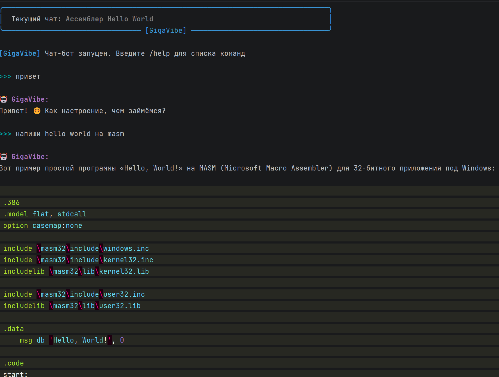

# GigaVibe



## Особенности реализации

- **Стриминг:** Ответы отображаются в реальном времени с форматированием (код, списки, жирный шрифт).

- **Управление чатами:** Команды для создания, переключения, переименования и удаления сессий прямо в терминале.

- **Авто-заголовки:** Бот сам придумывает название чата на основе первого сообщения.

- **Контроль контекста:** Автоматическая обрезка истории сообщений при достижении лимита токенов.

- **Технический стиль:** Ассистент настроен на лаконичные, экспертные ответы без лишних вступлений.

- **Персистентность:** Каждый чат — это отдельный JSON-файл в директории `chats/`, именуемый по UUID. Действия с чатами
  в консоли осуществляются через порядковый номер в `ChatManager.sessions`

- **FIFO-очистка контекста:** Реализован метод `limit_history`, который удаляет старые сообщения из начала истории (
  сохраняя системный промпт), если общее количество токенов превышает `MAX_TOKENS`.

- **Командный паттерн:** Ввод пользователя парсится: если строка начинается с `/`, управление передается в
  `commands.py`, иначе — отправляется в нейросеть.

- **Поведение AI:** Жестко задано через системный промпт `prompts/system_main.txt`:

## Быстрый старт

### 1. Установка зависимостей

```bash
pip install -r requirements.txt

```

### 2. Настройка (.env)

Создайте файл `.env` в корне проекта:

```env
GIGACHAT_CREDENTIALS="ваш_токен_авторизации"
GIGACHAT_MODEL="GigaChat"
GIGACHAT_VERIFY_SSL=False
MAX_TOKENS=4000

```

### 3. Запуск

```bash
python main.py

```

## Команды

* `/new` — новый чат
* `/list` — список всех чатов
* `/switch [ID]` — переключить чат
* `/rename [ID] <Имя>` — переименовать текущий чат
* `/delete [ID]` — удалить чат
* `/clear` — очистить историю текущего чата
* `/help` — список всех команд
* `/exit` — выход